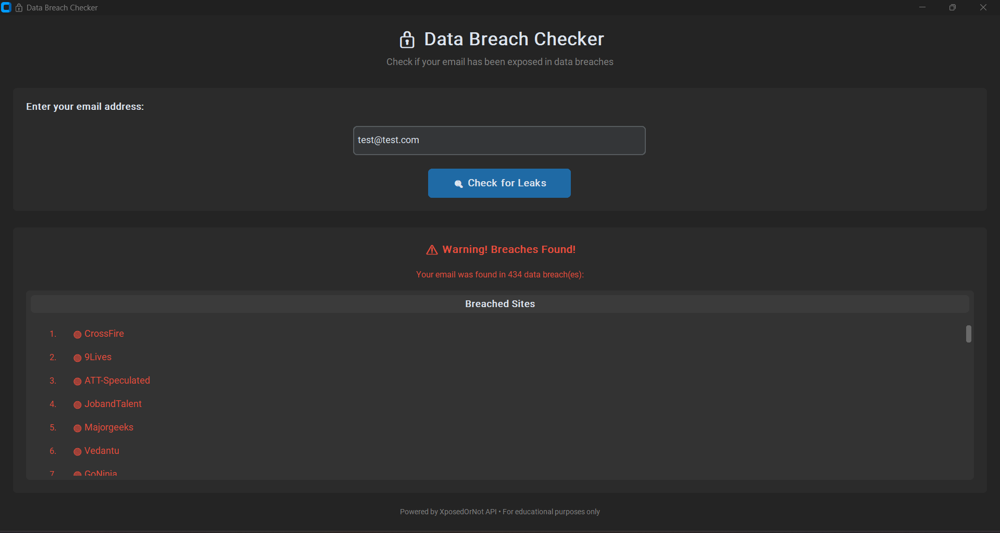

# 🔒 Data Breach Checker

A modern desktop application to check if your email address has been compromised in known data breaches. Built with Python and CustomTkinter, featuring a sleek Dark Mode interface.


---

## 📸 Screenshot

<!-- Add your screenshot here -->


---

## ✨ Features

- **🌙 Modern Dark Mode UI** - Clean and professional interface built with CustomTkinter
- **⚡ Real-time Breach Detection** - Instantly check if your email appears in known data breaches
- **📋 Detailed Breach List** - View a comprehensive, scrollable list of all breached sites
- **✅ Email Validation** - Validates email format before making API requests
- **🔄 Non-blocking UI** - API requests run in background threads for a smooth experience
- **⚠️ Error Handling** - Graceful handling of network errors, timeouts, and API issues
- **🖥️ Cross-platform** - Works on Windows, macOS, and Linux

---

## 🚀 How to Run

### Prerequisites

- Python 3.8 or higher
- pip (Python package installer)

### Installation Steps

1. **Clone the repository**
   ```bash
   git clone https://github.com/yourusername/Data-Breach-Checker.git
   cd Data-Breach-Checker
   ```

2. **Install dependencies**
   ```bash
   pip install -r requirements.txt
   ```

3. **Run the application**
   ```bash
   python breach_checker.py
   ```

---

## 📦 Dependencies

| Package | Description |
|---------|-------------|
| `customtkinter` | Modern GUI framework with dark mode support |
| `requests` | HTTP library for API communication |

---

## 🔧 Usage

1. Launch the application
2. Enter your email address in the input field
3. Click **"Check for Leaks"** or press **Enter**
4. View the results:
   - **✅ Green message** - Your email is safe, no breaches found
   - **⚠️ Red warning** - Your email was found in data breaches, review the list

---

## 🛡️ API Information

This tool uses the **XposedOrNot API** to check for data breaches:
- **API Endpoint**: `https://api.xposedornot.com/v1/check-email/{email}`
- **Method**: GET
- **Documentation**: [XposedOrNot](https://xposedornot.com/)

---

## ⚠️ Disclaimer

**IMPORTANT: Please read before using this tool.**

1. **Educational Purpose**: This tool is designed for **educational and personal security awareness purposes only**. Use it responsibly to check your own email addresses.

2. **Third-Party API**: This application relies on the [XposedOrNot](https://xposedornot.com/) API service. The developer of this tool is not affiliated with XposedOrNot and cannot guarantee the accuracy, availability, or reliability of the API.

3. **No Warranty**: This software is provided "as is", without warranty of any kind. The author is not responsible for any damages or issues arising from the use of this tool.

4. **Privacy**: Your email address is sent to the XposedOrNot API for verification. Please review their privacy policy before use.

5. **Legal Use**: Only use this tool to check email addresses that you own or have explicit permission to check.

6. **Security Recommendations**: If your email is found in a data breach:
   - Change your password immediately on the affected sites
   - Enable two-factor authentication (2FA) where available
   - Consider using a password manager
   - Monitor your accounts for suspicious activity

---

## 📄 License

This project is licensed under the MIT License.

---

## 🤝 Contributing

Contributions are welcome! Feel free to:
- Report bugs
- Suggest new features
- Submit pull requests

---

**Stay Safe Online! 🔐**
